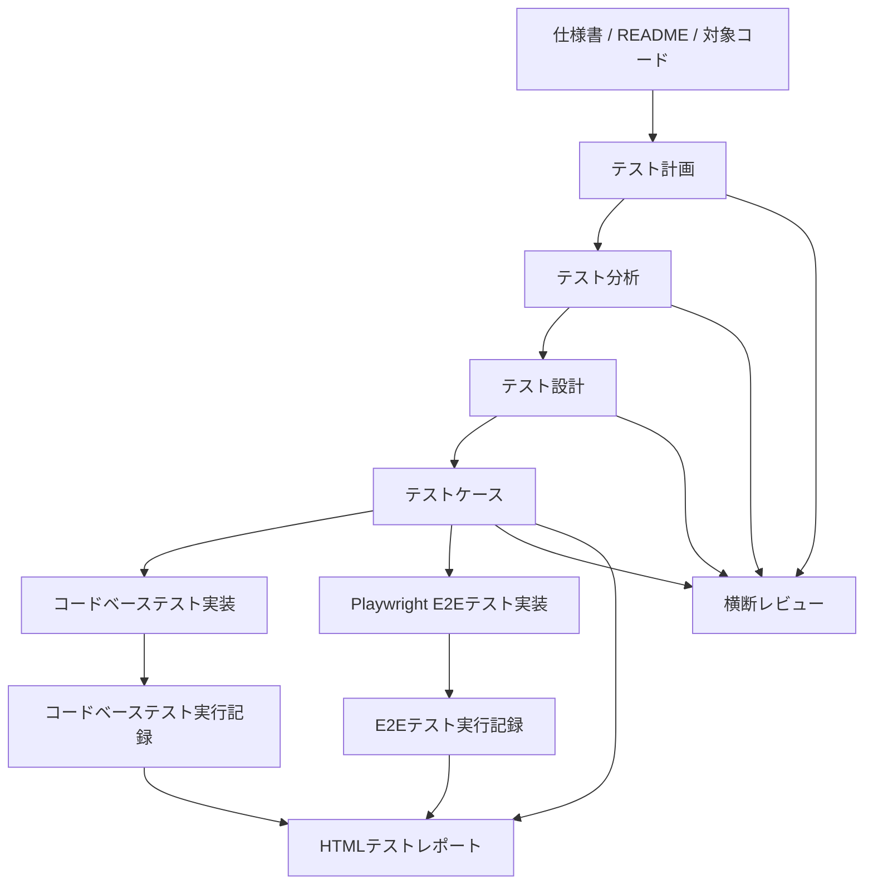

# テストプロセス Skills

このリポジトリは、仕様書やREADME、対象コードからテスト成果物を作成し、レビュー、テストコード実装、実行記録、HTMLレポート作成まで進めるための Codex skills をまとめたものです。

メインの入口は `$run-test-process` です。必要に応じて、テスト計画だけ、テスト設計だけ、E2Eテスト実装だけのように個別 skill も実行できます。

## 使い方

Codex に依頼するときは、使いたい skill 名を `$skill-name` の形式で指定します。

通しで実行する場合は、最初に次の情報を渡してください。

- 仕様書、README、画面仕様、API仕様などの参照資料
- テスト対象のコード、HTML、URL、アプリ入口、コンポーネントなど
- コードベーステストの実装対象
- E2E自動テストの実装対象
- 実行したいテストコマンドやブラウザ条件があればその指定

質問待ち、仕様未確定、環境不足、未実装のケースは無理に埋めず、質問票や未実装一覧、実行レポートに残します。人間実行テストは通し実行では自動実行せず、最終レポート上では未実行として扱います。

## メイン Skill

### `$run-test-process`

テスト計画から最終HTMLレポートまで、既存 skill を順番に使うオーケストレーション skill です。

実行順は次のとおりです。

1. `$create-test-plan`
2. `$review-test-plan`
3. `$create-test-analysis`
4. `$review-test-analysis`
5. `$create-test-design`
6. `$review-test-design`
7. `$create-test-cases`
8. `$review-test-cases`
9. `$review-test-artifacts`
10. `$create-test-code`
11. `$review-test-code`
12. `$execute-codebase-tests`
13. `$create-playwright-e2e-tests`
14. `$review-playwright-e2e-tests`
15. `$execute-playwright-e2e-tests`
16. `$create-test-report`

各レビュー工程では、高優先度の問題がなくなるまで修正と再レビューを繰り返します。実装対象や実行環境が足りない場合は、その工程だけ未実装または未実行として記録し、可能な範囲でレポート作成まで進めます。

## 個別 Skills

| Skill | 役割 | 主な出力 |
|---|---|---|
| `$create-test-plan` | 仕様書やREADMEからテスト計画書を作成します。目的、参照ドキュメント、テストアイテム、スコープ、終了条件、リスク、テストアプローチを整理します。 | `テスト成果物/テスト計画書.md` |
| `$review-test-plan` | テスト計画書をレビューし、優先度付きで問題を出し、高優先度問題を修正して再レビューします。 | `テスト成果物/テスト計画レビュー結果.md` |
| `$create-test-analysis` | テスト計画のアプローチをもとに、テスト観点と質問票を作成します。必要なら計画側のリスクやアプローチも更新します。 | `テスト成果物/テスト分析.md`, `テスト分析_質問票.md` |
| `$review-test-analysis` | テスト分析の抜け漏れ、粒度、トレーサビリティ、質問待ち管理などをレビューして改善します。 | `テスト成果物/テスト分析レビュー結果.md` |
| `$create-test-design` | テスト分析の各観点から、テストパターン、条件、実施方法、期待結果を設計表にします。 | `テスト成果物/テスト設計.md`, `テスト設計_質問票.md` |
| `$review-test-design` | テスト設計をレビューし、観点カバレッジ、リスクベースの深さ、判定可能性などを改善します。 | `テスト成果物/テスト設計レビュー結果.md` |
| `$create-test-cases` | テスト設計からMarkdown表のテストケースを作成します。コードベース、E2E自動、人間実行、質問待ちにファイルを分けます。 | `テストケース_コードベース.md`, `テストケース_E2E自動.md`, `テストケース_人間実行.md`, `テストケース_質問待ち.md` |
| `$review-test-cases` | テストケースの網羅性、実行可能性、期待結果、質問待ち、トレーサビリティをレビューして改善します。 | `テスト成果物/テストケースレビュー結果.md` |
| `$review-test-artifacts` | テスト計画、分析、設計、テストケースを横断レビューし、成果物間の矛盾や抜け漏れを改善します。 | `テスト成果物/テスト成果物横断レビュー結果.md` |
| `$create-test-code` | `テストケース_コードベース.md` から実テストコードを作成します。対象が未指定なら停止し、質問待ちや実装困難ケースは未実装一覧へ残します。 | テストコード, `テストコード実装結果.md`, `未実装テストケース_コードベース.md` |
| `$review-test-code` | コードベース用テストコードをレビューし、トレーサビリティ、判定妥当性、保守性、実行可能性を改善します。 | `テスト成果物/テストコードレビュー結果.md` |
| `$execute-codebase-tests` | コードベーステストを実行し、Pass/Fail/N/A、CSV、ログ、issue一覧を実行単位フォルダに記録します。 | `テスト成果物/report/yyyyMMddHHmmss_コードベーステスト/` |
| `$create-playwright-e2e-tests` | `テストケース_E2E自動.md` から Playwright のE2Eテストを作成します。質問待ちや自動化困難ケースは未実装一覧へ残します。 | Playwrightテスト, `Playwright_E2Eテスト実装結果.md`, `未実装テストケース_E2E自動.md` |
| `$review-playwright-e2e-tests` | Playwright E2Eテストをレビューし、高優先度問題を修正して再レビューします。 | `テスト成果物/Playwright_E2Eテストレビュー結果.md` |
| `$execute-playwright-e2e-tests` | Playwright E2Eテストを実行し、Pass/Fail/N/A、CSV、ログ、JSON、issue一覧を実行単位フォルダに記録します。 | `テスト成果物/report/yyyyMMddHHmmss_e2e自動テスト/` |
| `$create-test-report` | 現時点の成果物と最新の実行結果を固定し、HTMLレポートを作成します。 | `テスト成果物/report/yyyyMMddHHmmss_report/index.html` |

## 成果物の流れ



## プロンプト例

### 全工程を通しで実行する

```text
$run-test-process を使って、テスト計画からレポート作成まで通しで実行してください。

参照資料:
- spec/仕様書.md
- README.md

テスト対象:
- src/example.html

コードベーステスト実装対象:
- src/example.html

E2E自動テスト実装対象:
- src/example.html

Playwrightは利用可能です。依存やブラウザが不足している場合はインストールせず、N/Aまたは未実行として記録してください。
```

### テスト計画からテスト設計まで連続で作成する

```text
$create-test-plan、$review-test-plan、$create-test-analysis、$review-test-analysis、$create-test-design、$review-test-design を順番に実行してください。

参照資料は spec/仕様書.md と README.md です。
テストアイテムは src/example.html です。
レビューでは P0/P1 がなくなるまで修正と再レビューを繰り返してください。
質問が必要な箇所は推測せず、質問票にまとめてください。
```

### テストケース作成から横断レビューまで実行する

```text
$create-test-cases、$review-test-cases、$review-test-artifacts を順番に実行してください。

入力は テスト成果物/テスト設計.md、テスト成果物/テスト設計_質問票.md、テスト成果物/テスト分析.md、テスト成果物/テスト計画書.md です。
コードベース、E2E自動、人間実行、質問待ちでテストケースファイルを分けてください。
```

### コードベーステストだけ実装して実行する

```text
$create-test-code、$review-test-code、$execute-codebase-tests を順番に実行してください。

テスト対象は src/example.html です。
入力テストケースは テスト成果物/テストケース_コードベース.md です。
質問待ちや要確認のケースは 未実装テストケース_コードベース.md に残してください。
実行結果は report フォルダ配下の実行単位フォルダに保存してください。
```

### Playwright E2Eテストだけ実装して実行する

```text
$create-playwright-e2e-tests、$review-playwright-e2e-tests、$execute-playwright-e2e-tests を順番に実行してください。

E2E対象は src/example.html です。
入力テストケースは テスト成果物/テストケース_E2E自動.md です。
質問待ち、要確認、性能閾値未確定、Playwrightで安全に自動化できないケースは 未実装テストケース_E2E自動.md に残してください。
```

### レポートだけ作成する

```text
$create-test-report を使って、現在のテスト成果物と最新のコードベース/E2E実行結果からHTMLレポートを作成してください。

まだ実行していないテストケース、質問待ちのテストケース、未実装のテストケースは index.html に一覧を埋め込まず、詳細HTMLへのリンクとして表示してください。
```

## 出力先の目安

- テスト成果物: `テスト成果物/`
- 実行記録: `テスト成果物/report/yyyyMMddHHmmss_コードベーステスト/`, `テスト成果物/report/yyyyMMddHHmmss_e2e自動テスト/`
- HTMLレポート: `テスト成果物/report/yyyyMMddHHmmss_report/`
- コードベース issue: `コードベース_発見issue一覧.md`
- E2E issue: `e2e_発見issue一覧.md`

## 運用メモ

- 仕様や対象コードを編集する skill ではありません。明示依頼がない限り、仕様書、README、プロダクトコードは編集しません。
- レビュー系 skill は、問題を優先度付きで出し、高優先度のものを修正して再レビューします。
- 質問待ちや未確定情報は、推測で埋めずに質問票や未実装一覧に残します。
- Pass率は `Pass / (Pass + Fail)` で計算し、N/Aは分母に含めません。
- 人間実行テストの実行記録 skill は含まれていません。人間実行テストは作成・レビュー対象ですが、通し実行では未実行として扱います。
